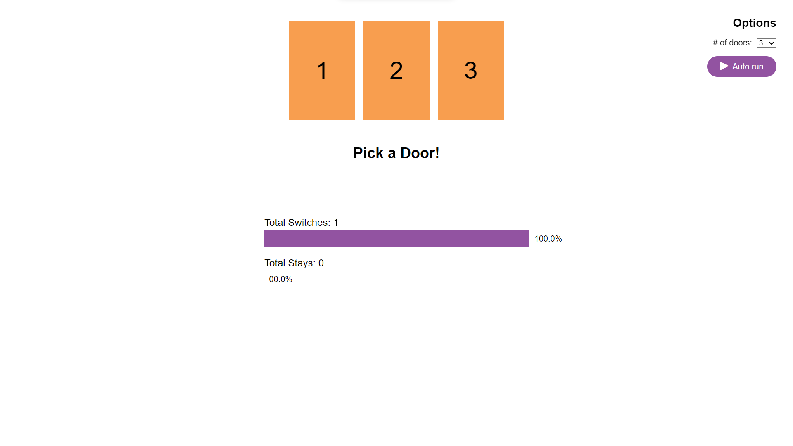

# The-monty-hall-problem

The monty hall problem consist of a scenerio where you are given n doors. And there is a goat behind n-1 doors and  a tresure behind one door. Now at start you have to choose one door after that you would be shown n-1 doors behind which goat is present now you have been given a chance to continue with your choice or to change to last door. 

<a href="https://arpitgoyal878.github.io/The-monty-hall-problem/"> Click Here to Play with the monty hall problem </a>

